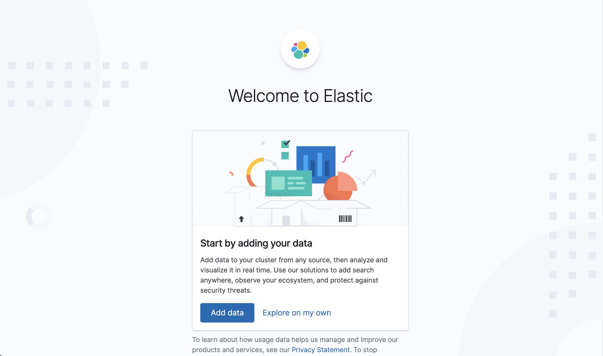

# 개요

elasticsearch와 kibana를 rook-ceph 환경으로 kubernetes상에 설치하는 가이드

# 버전

elasticsearch : 7.10.2 oss
kibana : 7.10.2 oss

elasticsearch는 7.11부터 라이센스가 변경되어 oss 버전을 지원하지 않아 상업적인 용도로 사용하는 경우 비용을 지불해야한다.
따라서 oss 버전 중 가장 나중에 릴리즈된 7.10.2를 선택한다.


**7.10.2 버전이라도, 유료기능이 포함된 일반 버전과, 해당 기능이 제거된 oss 버전이 따로 존재한다!**

# 순서

1. helm 설치
2. helm elasticsearch chart 다운로드
3. ceph RBD storageclass 설정, elasticsearch values.yaml 수정
4. elasticsearch 설치 & 테스트
5. kibana 설치 & 테스트


# helm 설치

```
curl -fsSL -o get_helm.sh https://raw.githubusercontent.com/helm/helm/main/scripts/get-helm-3
chmod 700 get_helm.sh
./get_helm.sh
```

# helm elasticsearch chart 다운로드

```
helm repo add elastic https://helm.elastic.co
helm repo update
helm pull elastic/elasticsearch --version 7.10.2
tar -zxvf elasticsearch-7.10.2.tgz
cd elastticsearch
```

# ceph RBD storageclass 설정, elasticsearch values.yaml 수정

1. 다음과 같은 storageclass를 생성한다.

단, 만약 db등을 생성하며 이미 RBD형식의 storageclass를 생성해 둔 경우, 추가로 생성할 필요가 없다.

```
apiVersion: storage.k8s.io/v1
kind: StorageClass
metadata:
   name: rook-ceph-block
provisioner: rook-ceph.rbd.csi.ceph.com
parameters:
    clusterID: rook-ceph
    pool: rbdpool
    imageFormat: "2"
    imageFeatures: layering
    csi.storage.k8s.io/provisioner-secret-name: rook-csi-rbd-provisioner
    csi.storage.k8s.io/provisioner-secret-namespace: rook-ceph
    csi.storage.k8s.io/controller-expand-secret-name: rook-csi-rbd-provisioner
    csi.storage.k8s.io/controller-expand-secret-namespace: rook-ceph
    csi.storage.k8s.io/node-stage-secret-name: rook-csi-rbd-node
    csi.storage.k8s.io/node-stage-secret-namespace: rook-ceph
    csi.storage.k8s.io/fstype: ext4

reclaimPolicy: Retain
allowVolumeExpansion: true
```

2. templates/poddisruptionbudget.yaml 파일 수정

7.10.2 버전의 helm 차트 오류로, 반드시 해당 파일의 apiVersion을 다음과같이 수정해주어야 정상적으로 설치된다.

```
apiVersion: policy/v1
```


3. values.yaml 수정

## oss 버전으로 image 경로 수정

7.10.2 버전 중 oss 버전을 사용해야하므로, image 경로를 `docker.elastic.co/elasticsearch/elasticsearch` 가 아니라, 

`docker.elastic.co/elasticsearch/elasticsearch-oss` 로 수정해야 한다.

## esConfig 수정

`esConfig` 부분을 다음과 같이 수정한다.

```
esConfig:
  elasticsearch.yml: |
    cluster.name: "elasticsearch"
    node.name: ${HOSTNAME}
    network.host: 0.0.0.0
    discovery.seed_hosts: ["node1의 ip","node2의 ip","node3의 ip","node4의 ip","node5의 ip","node6의 ip"]
    cluster.initial_master_nodes: ["elasticsearch-master-0", "elasticsearch-master-1", "elasticsearch-master-2"]
```

## volumeClaimTemplate 수정

`volumeClaimTemplate`의 내용을 다음과 같이 수정한다.

```
volumeClaimTemplate:
  accessModes: [ "ReadWriteOnce" ]
  storageClassName: "crook-ceph-block" # 앞서 생성한 StorageClass 이름
  resources:
    requests:
      storage: 100Gi # 각 노드가 요청할 스토리지 크기
```


# elasticsearch 설치 & 테스트

`helm install elasticsearch ./ -n {네임스페이스명}`


그 후 k9s에서 정상적으로 pod들과 pvc들이 정상적으로 생성 및 mount, init되었는지 확인하고, 다음 명령어를 통해 테스트할 수 있다.

`helm test elasticsearch -n {네임스페이스명}`

다음과 같이 출력된다면 성공이다.

```
NAME: elasticsearch
LAST DEPLOYED: Wed Apr 10 18:47:02 2024
NAMESPACE: {네임스페이스명}
STATUS: deployed
REVISION: 1
TEST SUITE:     elasticsearch-dkqgf-test
Last Started:   Fri Apr 12 10:01:14 2024
Last Completed: Fri Apr 12 10:01:23 2024
Phase:          Succeeded
NOTES:
1. Watch all cluster members come up.
  $ kubectl get pods --namespace={네임스페이스명} -l app=elasticsearch-master -w
2. Test cluster health using Helm test.
  $ helm test elasticsearch
```


# kibana 설치 & 테스트

kibana 역시 `https://helm.elastic.co` 안에 포함되어있으므로, 따로 repository를 별도로 add할 필요는 없다.

따라서 바로 pull하고, 설치하자.

```
helm pull elastic/kibana --version 7.10.2
tar -zxvf kibana-7.10.2.tgz
cd kibana/
```

## oss 버전 수정

7.10.2 버전 중 oss 버전을 사용해야하므로, image 경로를 `docker.elastic.co/kibana/kibana` 가 아니라, 

`docker.elastic.co/kibana/kibana-oss` 로 수정해야 한다.

## 외부접속 허용

`values.yaml` 내용중, Nodeport를 사용하여 외부접속을 허용하기 위해 다음 부분을 수정한다.

```
service:
  type: ClusterIP
  loadBalancerIP: ""
  port: 5601
  nodePort: ""
  labels: {}
  annotations: {}
    # cloud.google.com/load-balancer-type: "Internal"
    # service.beta.kubernetes.io/aws-load-balancer-internal: 0.0.0.0/0
    # service.beta.kubernetes.io/azure-load-balancer-internal: "true"
    # service.beta.kubernetes.io/openstack-internal-load-balancer: "true"
    # service.beta.kubernetes.io/cce-load-balancer-internal-vpc: "true"
  loadBalancerSourceRanges: []
    # 0.0.0.0/0
  httpPortName: http
```

위 부분을,

```
service:
  type: NodePort
  port: 5601
```

으로 수정한다. 그 후, 다음 명령어를 통해 설치한다.

`helm install kibana ./ -n {네임스페이스명}`

이후 k9s의 `service` 에서 kibana service가 어느 port로 연결되어있는지 확인할 수 있다.

마스터노드 중 하나의 ip의 해당 portfh 접속했을 때 다음과 같이 나온다면 설치가 완료된 것이다.




