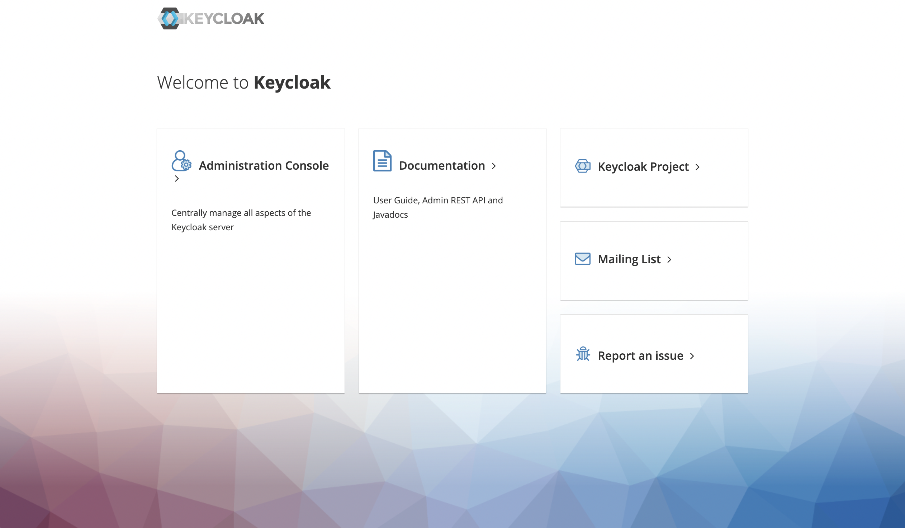
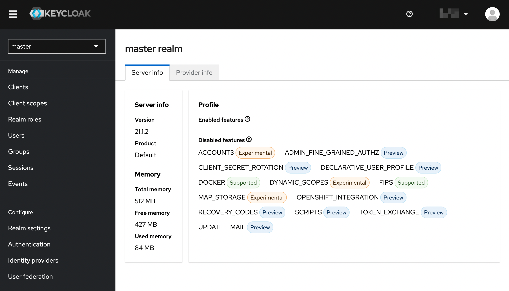

# keycloak 설치 가이드

본 문서는 helm을 활용하여 keycloak을 설치하는 가이드임

# 개요

## 버전

사용된 버전은 다음과 같음

OS : xUbuntu_22.04

kubernetes : v1.25.6

kubespray : 2.21

db: timescaledb:2.11.0-pg14

istio : 1.17.8

keycloak helm chart : 15.1.8

keycloak : keycloak:21.1.2

keycloak의 경우, 현재 시점 기준, helm chart 15.1.8 이후 버전의 [어드민 콘솔 페이지 관련 이슈](https://github.com/keycloak/keycloak/issues/14666)가 아직 open 상태기때문에, 그 이전 버전으로 설치함.

## 설치&테스트 순서

1. helm chart update
2. keycloak Database 및 User 생성
3. keycloak의 values.yaml 파일 작성
4. 설치
5. 관리 페이지 라우팅 설정
6. 관리자 계정 접속 확인

# helm chart update

keycloak 이미지가 들어있는 `bitnami` repository를 다음 명령어를 통해 추가한다.

```
helm repo add bitnami https://charts.bitnami.com/bitnami
helm repo update
```

# keycloak Database 및 User 생성

database pod의 콘솔에서, DB 관리자 계정으로 접속한 뒤, 다음 명령어를 통해 keycloak에 사용할 Database와 그 Owner 유저를 생성한다.

```
# 유저 생성
CREATE USER {사용할 keycloak 관리 계정명} WITH PASSWORD '{사용할 비밀번호}';

# DB 생성
CREATE DATABASE {keycloak에서 사용할 db명} OWNER {사용할 keycloak 관리 계정명}
```

# keycloak의 values.yaml 파일 작성

keycloak의 설치 설정을 결정할 values.yaml 파일을 다음과 같이 설정한다.

```yaml
auth:
  adminUser: {생성할 keycloak 관리자 계정명}
  adminPassword: {생성할 keycloak 관리자 계정 비밀번호}

ingress:
  enabled: false # 직접 istio-ingress로 라우팅하기 위해 false로 설정

postgresql:
  enabled: false # 외부 db와 연결하기 위해 false로 설정
externalDatabase:
  host: timescaledb-proxy.{timescaledb가 올라가있는 namespace명}.svc.cluster.local # postgres DB host
  port: 5432
  user: {위에서 생성한 keycloak 관리 계정명} # DB user
  database: {위에서 생성한 keycloak db명} # DB database
  password: {위에서 생성한 keycloak 관리 계정 비밀번호} # DB password
autoscaling:
  # If `true`, a autoscaling/v2beta2 or autoscaling/v2 HorizontalPodAutoscaler resource is created (requires Kubernetes 1.18 or 1.23 or above)
  # Autoscaling seems to be most reliable when using KUBE_PING service discovery (see README for details)
  # This disables the `replicas` field in the StatefulSet
  enabled: true
  # Additional HorizontalPodAutoscaler labels
  labels: {}
  # The minimum and maximum number of replicas for the Keycloak StatefulSet
  minReplicas: 3
  maxReplicas: 10
  # The metrics to use for scaling
  metrics:
    - type: Resource
      resource:
        name: cpu
        target:
          type: Utilization
          averageUtilization: 80
  # The scaling policy to use. This will scale up quickly but only scale down a single Pod per 5 minutes.
  # This is important because caches are usually only replicated to 2 Pods and if one of those Pods is terminated this will give the cluster time to recover.
  behavior:
    scaleDown:
      stabilizationWindowSeconds: 300
      policies:
        - type: Pods
          value: 1
          periodSeconds: 300
```

# 설치

다음 명령어를 통해 위에서 작성한 `values.yaml` 파일을 적용하여 설치한다.

```
kubectl create namespace keycloak
helm upgrade -i keycloak bitnami/keycloak -f v.yaml --version 15.1.8 -n keycloak
```

그 후, DB에 접속하여 keycloak 서비스가 init되며 관련 table들이 정상적으로 생성되었는지 확인한다.

## Trouble shooting

만약 admin 계정이 이미 존재하여 생성에  실패했다는 에러가 난 경우, 단순히 해당 데이터베이스를 drop해버린 후 다시 생성하면 된다.

# keycloak 관리페이지 라우팅 설정

istio-ingress의 gateway와 virtualservice를 올려 keycloak 관리페이지에 접속할 수 있도록 라우팅한다.

사전에, istio 설치 가이드를 통해 istio 관련 설정을 마치고, external ip 중 keycloak으로 사용가능한 ip가 남아있는 상황에서의 라우팅 가이드이므로, 실제 자신의 환경에 맞게 방법이나 사전 구성필요 요소가 달라질 수 있다.

아래와 같은 내용으로 `keycloak_route.yaml` 파일을 생성한다.

```yaml
apiVersion: networking.istio.io/v1beta1
kind: Gateway
metadata:
  name: keycloak-gateway
  namespace: keycloak
spec:
  selector:
    istio: {istio ingress 서비스 명}  # 수정된 부분: 이제 올바른 레이블을 참조합니다.
  servers:
  - port:
      number: 80
      name: http
      protocol: HTTP
    hosts:
    - "{keycloak 관리페이지로 사용할 ip}"

---
apiVersion: networking.istio.io/v1beta1
kind: VirtualService
metadata:
  name: keycloak
  namespace: keycloak
spec:
  hosts:
  - "{keycloak 관리페이지로 사용할 ip}"
  gateways:
  - keycloak-gateway
  http:
  - match:
    - uri:
        prefix: "/"
    route:
    - destination:
        host: keycloak
        port:
          number: 80

```

그 후, 해당 파일을 다음 명령어를 통해 적용한다.

`kubectl apply -f keycloak_route.yaml`

# 관리자 계정 접속 확인

라우팅한 ip에 접속하였을 때 우선, 다음과 같이 출력되어야 한다.



그 후, `Administration Consolse`에 위에 설정했던 관리자 아이디와 비밀번호로 로그인하였을때, 다음과 같은 화면이 출력된다면 정상적으로 설치된 것이다.

