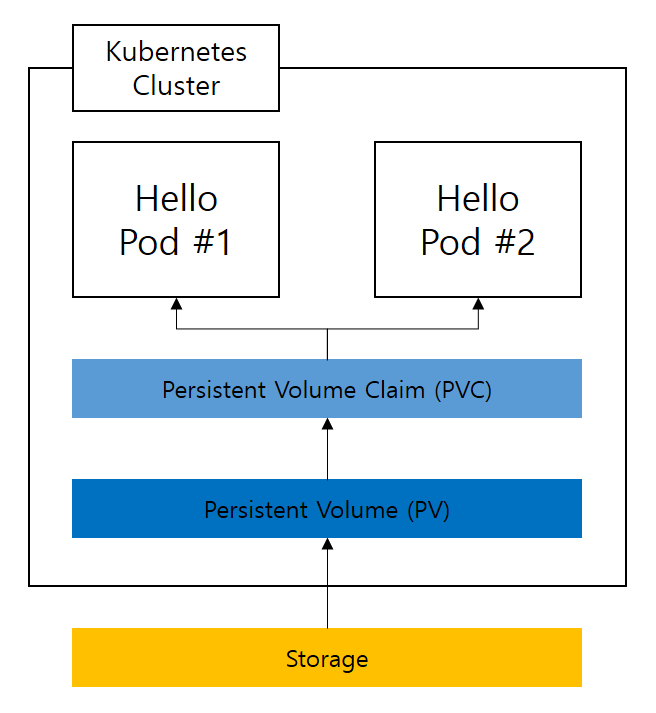

# rook-ceph 설치 및 테스트 가이드

반드시 사전에 kubernetes 클러스터를 정상적으로 구축해두어야 한다.

rook-ceph의 설치 순서는 다음과 같다.

1. osd로 사용할 디스크 초기화
2. Rook 설치, ceph 올리기
3. ceph 모니터링 도구 설치 및 확인
4. 실제 볼륨 생성, 마운트해보기

# osd로 사용할 디스크 초기화
[Rook 홈피링크](https://rook.github.io/docs/rook/latest-release/Getting-Started/quickstart/#prerequisites)

ceph 파일 시스템은 기본적으로 다음 조건들을 만족하는 디스크들을 자동으로 검색하여 ods로 사용한다.[(공식문서)](https://docs.ceph.com/en/latest/cephadm/services/osd/#deploy-osds)


1. The device must have no partitions.

2. The device must not have any LVM state.

3. The device must not be mounted.

4. The device must not contain a file system.

5. The device must not contain a Ceph BlueStore OSD.

6. The device must be larger than 5 GB.

따라서 각 조건에 맞게 osd로 사용할 디스크의 설정을 확인/변경해야 한다.

우선, 마운트 된 디스크라면 마운트를 해제한다.

그 후, osd로 사용할 디스크를 완전히 초기화한다. 디스크의 파티션,filesystem 등 모든 정보를 초기화하는 위험한 명령어이니 해당 디스크에 필요한 데이터가 남아있진 않은지, 초기화 대상 디스크가 정말로 초기화할 디스크가 맞는지 면밀히 확인해야 한다.

명령어 예시는 아래와 같다.

```
sudo dd if=/dev/zero of={디스크 디렉토리} bs=4096 count=4096
```


<!-- `sudo fdisk -l`

그리고 마운트되어있는 디스크의 목록을 다음 명령어를 통해 확인하자.

`df -h`

이 두 명령어의 출력결과를 통해 원하는 드라이브가 실제로 마운트되어있는지 여부를 확인할 수 있다.

제대로 마운트되어있지 않다면, 마운트 할 디렉토리를 각 드라이브별로 생성하고, 재부팅 시 자동으로 마운트 될 수 있도록 설정해야 한다.

자세한 방법은 다음과 같다. -->


<!-- ```
# 1. 각 드라이브 별 사용할 마운트 디렉토리를 생성한다.
sudo mkdir -p /mnt/hdd1
sudo mkdir -p /mnt/hdd2

# 2. 각 드라이브 별 UUID를 확인한다.
sudo blkid

# 3. /etc/fstab 파일을 열어 각 드라이브 별 마운트 설정을 다음과 같이 설정한다.
UUID={마운트 할 드라이브의 UUID} /mnt/hdd1 ext4 defaults 0 0
UUID={마운트 할 드라이브의 UUID} /mnt/hdd2 ext4 defaults 0 0

# 4. 마운트 설정에 따라 마운트한다.
``` -->


# Rook 설치, ceph 올리기


```
git clone --single-branch --branch v1.13.7 https://github.com/rook/rook.git
cd rook/deploy/examples
kubectl create -f crds.yaml -f common.yaml -f operator.yaml

kubectl create -f cluster.yaml

```


# 유틸 설치, 동작 확인

```
kubectl -n rook-ceph get pod
cd ../../

(rook 디렉토리에서 다음을 실행)

kubectl create -f deploy/examples/toolbox.yaml
kubectl -n rook-ceph rollout status deploy/rook-ceph-tools
```

모니터링 쉘 실행

`kubectl -n rook-ceph exec -it deploy/rook-ceph-tools -- bash`

해당 쉘 내에서,

`ceph status`

를 통해 상태를 확인할 수 있다. 정상적으로 동작한다면 다음과 같은 출력을 확인할 수 있다.

```
  cluster:
    id:     0ee4c632-eee3-44fe-aa78-47cd5bedaed6
    health: HEALTH_OK
 
  services:
    mon: 2 daemons, quorum a,c (age 6m)
    mgr: a(active, since 4s), standbys: b
    osd: 0 osds: 0 up, 0 in
 
  data:
    pools:   0 pools, 0 pgs
    objects: 0 objects, 0 B
    usage:   0 B used, 0 B / 0 B avail
    pgs:     
  
```

만약 `HEALTH_WARN mons are allowing insecure global_id reclaim` 이라고 출력된 경우, 아직 ceph이 구성중이므로 완료될때까지 기다린 후 다시 조회하자.

## Truble shooting

### OSD가 올라가지 않은 경우

OSD가 정상적으로 올라가지 않은 경우, ceph status 명령어를 입력했을 때 다음과 같이 나올 것이다.

```
  cluster:
    id:     0ee4c632-eee3-44fe-aa78-47cd5bedaed6
    health: HEALTH_ERR
            Module 'rook' has failed: No storage class exists matching name provided in ceph config at mgr/rook/storage_class
            OSD count 0 < osd_pool_default_size 3
 
  services:
    mon: 3 daemons, quorum a,c,d (age 39m)
    mgr: a(active, since 13m), standbys: b
    osd: 0 osds: 0 up, 0 in
 
  data:
    pools:   0 pools, 0 pgs
    objects: 0 objects, 0 B
    usage:   0 B used, 0 B / 0 B avail
    pgs:     

```

이 경우, 맨 처음의 osd 조건을 만족하는 디스크가 없어 정상적으로 osd가 올라가지 않은 상태이다.

각 조건에 맞게 정상적으로 수정했다면, 그 후 다음 명령어를 입력하여 osd로 가용한 디스크를 스캔하고 ceph이 사용하도록 설정할 수 있다.

`ceph orch apply osd --all-available-devices`

### worker node의 수가 3개보다 적은 경우

만약, worker node가 3개보다 적다면, ceph의 정책상 동작이 정상적으로 돌아가고있지 않음을 확인할 수 있다. 이는 분산스토리지인 ceph의 설계상 Single Point of Failure가 발생하지 않도록 하기 위해 최소한의 개수이다.

default 설정으로 최소 3개의 워커노드에 각각의 모니터가 running상태로 등록되어야하는데, 이것이 잘 되고있는지는 다음 명령어로 확인할 수 있다.

`kubectl -n rook-ceph get pods -l app=rook-ceph-mon`


# 실제 볼륨 생성, 마운트해보기

설치가 끝났으니 볼륨을 실제로 생성하여 사용해보아야 한다.

순서는 다음과 같다

## 순서

1. ceph이 지원하는 스토리지 종류 파악하기
2. ceph에서 PV, PVC 등, 파일시스템을 어떻게 만들고 관리하는지 파악하기
3. 실제로 생성하여 테스트


## ceph이 지원하는 스토리지 종류 파악하기

ceph은 크게 3가지 형태의 스토리지를 지원한다. [공식문서](https://rook.io/docs/rook/v1.11/Storage-Configuration/Block-Storage-RBD/block-storage/)

1. RBD - 블록 스토리지
2. CephFS - 분산파일시스템
3. RGW - 오브젝트 스토리지

우선 각각의 특징을 파악해야 한다. 이 부분은 개념적인 부분으로, 이미 잘 알고있다면 스킵하면 된다.

### RBD

장점 : 빠름
단점 : 하나의 pod에서만 접근하는 것을 권장

주 용도 : DB

하나의 pod에서만 주로 사용되는 스토리지. 블록 스토리지이기 때문에 접근이 빠르다.

왜 빠른지에 대해 조금 더 설명하자면, 우리가 일반적으로 사용하는 파일시스템은 기본적으로 디렉토리 주소를 통해 관리한다.

그 디렉토리 주소로 관리된다는 것 자체가, 이미 우리와 실제 저장소 사이에서 디렉토리 주소를 실제 저장되는 위치로 번역해주는 매니저가 있다는 의미이다. 따라서 블록스토리지는 그런 중간과정 없이 직접 접근할 수 있으므로, 속도가 상대적으로 빠르다.

### CephFS

장점 : 디렉토리 주소로 데이터 관리, 여러 포드에서 동시접근 가능
단점 : RBD보다는 느림

주 용도 : 서비스 별 파일데이터 저장, 컨테이너 레지스트리 등

디렉토리를 통해 데이터를 관리하여 익숙하다. 여러 pod에서 동시에 읽고, 쓰는 것이 가능하다.
이것은 디렉토리와 실제 저장소 사이의 중간관리자인 메타데이터 서버(MDS)가 디렉토리로 접근할 수 있게끔 기능을 제공하면서, 동시에 여러 포드로부터 요청이 들어올때 교통정리도 해주기 때문이다.

즉 엄밀히 말하자면, RBD의 위에 MDS라는 매니저가 하나 붙어서 디렉토리라는 익숙한 형태로 접근할 수 있게 해주고, 여러 포드에서 동시접근이 가능하게끔 기능이 추가된 형식이라 볼 수 있다.

### RGW

특징 : key-value 느낌의, 오브젝트 형태로 데이터를 저장, RESTFUL API형태로 데이터에 접근

장점 : CephFS나 RBD와 다르게 용량제한을 설정안해서 확장하기 좋음, 순차 데이터조회 최적화 잘되어있음, 특징이 장점이 될 수 있음

단점 : 특징이 단점이 될 수 있음.

주 용도 : 빅데이터 분석


## ceph에서 PV, PVC 등, 파일시스템을 어떻게 만들고 관리하는지 파악하기

쿠버네티스에서 PV, PVC를 일반적으로 그림으로 표현할때, 다음과 같이 나타낸다.



Storage에 PV를 생성하고, PV와 1대1로 연결되는 PVC에 용량을 할당한 다음, 각종 pod에서 PVC에 접근한다.


ceph에서는 조금 다른 부분이 있다. ceph은 다음과 같은 순서로 yaml파일을 작성/실행하여 실제 pod에서 사용가능한 파일시스템을 구축하게된다.

1. 사용할 Storage 생성
2. StorageClass
3. PVC 생성
4. pod에 PVC 마운트

1,3,4번의 경우 쿠버네티스의 PV 관리와 거의 동일하지만, 2번이 조금 다르다.

StorageClass는 PV가 아니라, PV를 어떻게 생성/삭제시킬 지 자동적으로 처리될 수 있게끔 하는 설정이다.

이렇게 관리하는 이유는, 어차피 PV는 PVC와 1대1 매칭되는 관계이기 떄문에, PV와 PVC를 따로 생성하는 것 보다, StorageClass에서 PV관련 설정만 해주고, PVC 생성 시 Ceph에서 자동으로 PV가 먼저 만들어지고 연결되도록 구성하기 때문이다.

## 실제로 생성하여 테스트

필자의 경우 RBD, CephFS 2가지를 설치하여 테스트하였다.

### CephFS

1. 스토리지 생성

우선 `filesystem.yaml` 파일을 아래와 같은 내용으로 만든다.

```
apiVersion: ceph.rook.io/v1
kind: CephFilesystem
metadata:
  name: myfs
  namespace: rook-ceph
spec:
  metadataPool:
    replicated:
      size: 3
  dataPools:
    - name: replicated
      replicated:
        size: 3
  preserveFilesystemOnDelete: true
  metadataServer:
    activeCount: 1
    activeStandby: true
```

위 내용 중 metadata의 name을 통해 PV, PVC와 연결될 것이다.

meta와 datapool의 replicated는 3으로 설정하면 하나가 고장나도 나머지 2개로 잘 사용할 수 있다.
만약 worker node의 수가 더 많더라도, replicated가 늘어나면 가용한 공간이 줄어들기때문에, 얼마나 데이터의 내구성이 중요한지 고려하여 설정하면 된다.

preserveFilesystemOnDelete 의 경우, 파일시스템을 `kubectl delete` 등으로 삭제했을 때 실제로 내부의 데이터를 싹 삭제할지에 대한 설정이다. 현재는 테스트환경이기때문에 true로 설정하였지만, 실제로 데이터가 삭제되면 안되는 운용환경이라면, false로 설정하는 것이 좋다.

이 설정대로 아래 명령어를 통해 filesystem을 생성해보자.

`kubectl create -f filesystem.yaml`

2. 스토리지클래스 생성

`storageclass.yaml` 파일을 아래와 같은 내용으로 만든다.

```
apiVersion: storage.k8s.io/v1
kind: StorageClass
metadata:
  name: rook-cephfs
# Change "rook-ceph" provisioner prefix to match the operator namespace if needed
provisioner: rook-ceph.cephfs.csi.ceph.com
parameters:
  # clusterID is the namespace where the rook cluster is running
  # If you change this namespace, also change the namespace below where the secret namespaces are defined
  clusterID: rook-ceph

  # CephFS filesystem name into which the volume shall be created
  fsName: myfs

  # Ceph pool into which the volume shall be created
  # Required for provisionVolume: "true"
  pool: myfs-replicated

  # The secrets contain Ceph admin credentials. These are generated automatically by the operator
  # in the same namespace as the cluster.
  csi.storage.k8s.io/provisioner-secret-name: rook-csi-cephfs-provisioner
  csi.storage.k8s.io/provisioner-secret-namespace: rook-ceph
  csi.storage.k8s.io/controller-expand-secret-name: rook-csi-cephfs-provisioner
  csi.storage.k8s.io/controller-expand-secret-namespace: rook-ceph
  csi.storage.k8s.io/node-stage-secret-name: rook-csi-cephfs-node
  csi.storage.k8s.io/node-stage-secret-namespace: rook-ceph

reclaimPolicy: Delete
```

위에서 설명했던 것 처럼, StorageClass는 PV에 관한 설정 세팅이다.

`myfs` 라는 파일시스템을 사용할거고, 이 설정파일을 사용하기 위한 `name`은 `rook-cephfs` 등을 중점적으로 보면 된다.

여기서 `reclaimPolicy` 설정은, 위에서 파일시스템의 `preserveFilesystemOnDelete`와 유사하다.

PVC가 `kubectl delete` 등으로 삭제될 때 PV를 자동으로 삭제하고 그 안의 데이터까지 싹 날려버릴것인지, 말지에 대한 설정이다.

이 역시 현재는 테스트 환경이므로 `Delete` 로 해 두었지만, 실제 운용환경에서는 `Retain` 으로 설정하는 것이 권장된다.

`Retain` 으로 설정했을 경우, 후술할 PVC를 생성하고 사용하다가 다시 삭제하였을 때, PV는 'Released' 된 상태로 남아있게 된다. 그것을 다시 동일한 storageclass name을 통해 PVC를 생성하면, 이전 데이터를 다시 연결하여 사용할 수 있게 된다.

이 설정대로 아래 명령어를 통해 storageclass를 생성해보자.

`kubectl create -f storageclass.yaml`


3. PVC 생성

아래와 같이 `pvc.yaml`을 생성한다.

```
apiVersion: v1
kind: PersistentVolumeClaim
metadata:
  name: cephfs-pvc
  namespace: kube-system
spec:
  accessModes:
  - ReadWriteMany
  resources:
    requests:
      storage: 1Gi
  storageClassName: rook-cephfs
```

여기서는 나중에 pod에서 mount할때 사용하기 위한 pvc의 이름과, 어떤 storageclass를 사용할지 `storageClassName` 을 통해 연결하고,`accessModes`로 다양한 사용자의 접근을 허용할지 말지 등과, 실제로 사용할 storage의 용량 제한 등을 설정한다.

이 설정대로 아래 명령어를 통해 pvc를 생성해보자.

`kubectl create -f pvc.yaml`

4. pvc를 mount하는 pod 생성, 사용 테스트

이 부분은 어떤 pod를 만들어도 상관없으나, 본 가이드에서는 공식문서의 예제를 활용한다. 따라서 테스트용으로 올려보고싶은 pod가 있다면, 중요한 설정 부분만 참고하여 직접 테스트하면 된다.

아래와 같이 `pod.yaml` 파일을 만든다.

```
apiVersion: apps/v1
kind: Deployment
metadata:
  name: kube-registry
  namespace: kube-system
  labels:
    k8s-app: kube-registry
    kubernetes.io/cluster-service: "true"
spec:
  replicas: 3
  selector:
    matchLabels:
      k8s-app: kube-registry
  template:
    metadata:
      labels:
        k8s-app: kube-registry
        kubernetes.io/cluster-service: "true"
    spec:
      containers:
      - name: registry
        image: registry:2
        imagePullPolicy: Always
        resources:
          limits:
            cpu: 100m
            memory: 100Mi
        env:
        # Configuration reference: https://docs.docker.com/registry/configuration/
        - name: REGISTRY_HTTP_ADDR
          value: :5000
        - name: REGISTRY_HTTP_SECRET
          value: "Ple4seCh4ngeThisN0tAVerySecretV4lue"
        - name: REGISTRY_STORAGE_FILESYSTEM_ROOTDIRECTORY
          value: /var/lib/registry
        volumeMounts:
        - name: image-store
          mountPath: /var/lib/registry
        ports:
        - containerPort: 5000
          name: registry
          protocol: TCP
        livenessProbe:
          httpGet:
            path: /
            port: registry
        readinessProbe:
          httpGet:
            path: /
            port: registry
      volumes:
      - name: image-store
        persistentVolumeClaim:
          claimName: cephfs-pvc
          readOnly: false
```

본 예제는 docker registry를 구성하고있다. 이곳에서 중요한 부분을 하나씩 짚어보자.

```
      volumes:
      - name: image-store
        persistentVolumeClaim:
          claimName: cephfs-pvc
          readOnly: false
```

우선, 마지막에 기재된 `volumes` 부분이다.

여기서 `claimName`을 통해 어떤 PVC를 사용할 것인지 선택하고, 이 볼륨의 이름을 정의한다.

```
        volumeMounts:
        - name: image-store
          mountPath: /var/lib/registry
```

이 부분에서는 위에서 정의한 볼륨의 이름을 통해, 이 pod가 실행되는 가상환경 속에서 어떤 path에 mount할 것인지 설정한다.

```
spec:
  replicas: 3
```

filesystem을 여러 pod에서 공유하며 사용할 수 있는지 테스트할 것이기때문에, replica를 여러개로 두었다. 이렇게 하면 동일한 기능을 수행하는 pod가 3개 생기게된다.

아래 명령어를 통해 pod를 생성하자.

`kubectl create -f pod.yaml`

그 후, k9s를 통해 pod의 쉘에 들어가 마운트한 경로에 접근할 수 있고, 그 안에 파일을 생성하거나 삭제하면 그 내용이 다른 replica에서 접근하였을 때도 동일하게 확인할 수 있음을 알 수 있다.